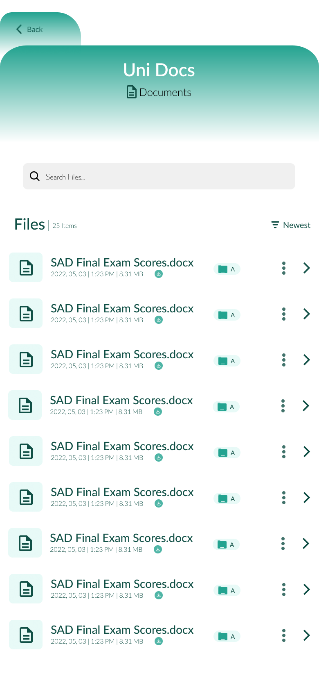

System Analysis and Design Final Project Frontend
========================================

This repo is the front-end part of the file management project for the SAD course instructed by Dr. Mehdi Mostafazade at the Sharif University of Technology. The backend code can be found [here](https://github.com/theablemo/System-Analysis-and-Design-Project-Backend/).

# Collborators

- [Mohammad Abolnejadian](https://github.com/theablemo)
- [Mohammadali Khodabandelou](https://github.com/amirrezamirzaei)
- [Amirreza Mirzaei](https://github.com/MohammadAli-Khodabandelou)
- [Alireza Eiji](https://github.com/AlirezaEiji191379)
- [Matin Daghyani](https://github.com/mtndaghyani)

# Introduction to the platform

This project is an Android-first application that can be used as a file-sharing platform. Easily upload your files to your account and download them anywhere using your personal account. This app is made to make managing your files easy and delightful, with a modern and colorful design.

# Usage

In order to run this project, you should have the [Flutter SDK](https://flutter.dev/) installed on your system. Once you have that, you can build the project.
Note that some dependencies might be out-of-date by the time you clone this project.

# Design

The UI of this project was designed by the Figma software. Following are some of the most important pages of this app.

**Login**

**Home Page**

**More options for a File**

**File Library**

